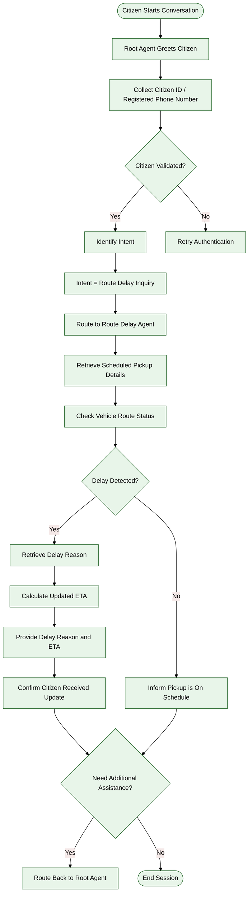

## Happy Path 04 (Route Delay)

```mermaid
%%{init: {'theme':'base','themeVariables':{
'primaryColor':'#E8F5E9',
'primaryBorderColor':'#1B5E20',
'primaryTextColor':'#000000',
'lineColor':'#000000'
}}}%%

flowchart TD

    A([Citizen Starts Conversation])
    --> B[Root Agent Greets Citizen]

    B --> C[Collect Citizen ID / Registered Phone Number]

    C --> D{Citizen Validated?}

    D -->|Yes| E[Identify Intent]
    D -->|No| F[Retry Authentication]

    E --> G[Intent = Route Delay Inquiry]

    G --> H[Route to Route Delay Agent]

    H --> I[Retrieve Scheduled Pickup Details]

    I --> J[Check Vehicle Route Status]

    J --> K{Delay Detected?}

    K -->|Yes| L[Retrieve Delay Reason]

    L --> M[Calculate Updated ETA]

    M --> N[Provide Delay Reason and ETA]

    N --> O[Confirm Citizen Received Update]

    O --> P{Need Additional Assistance?}

    P -->|Yes| Q[Route Back to Root Agent]

    P -->|No| R([End Session])

    K -->|No| S[Inform Pickup is On Schedule]

    S --> P

```
