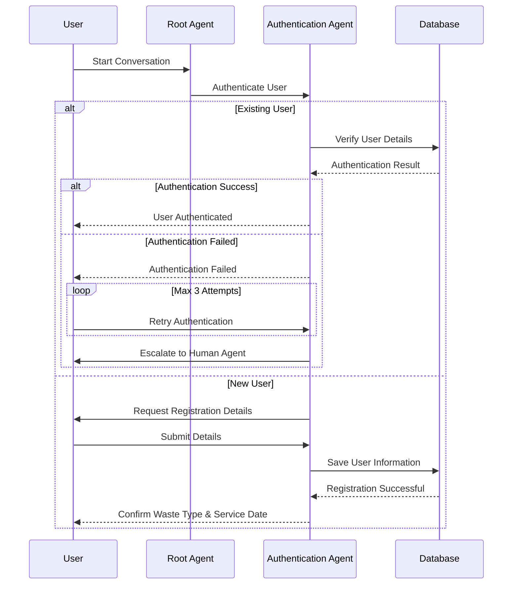
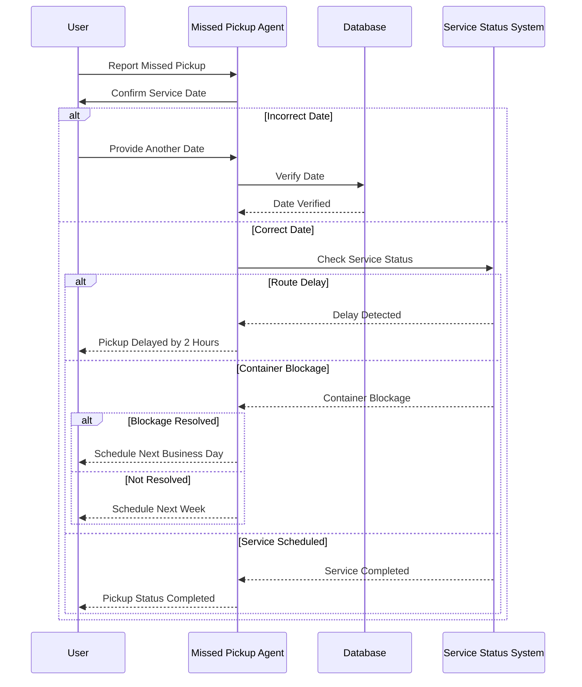
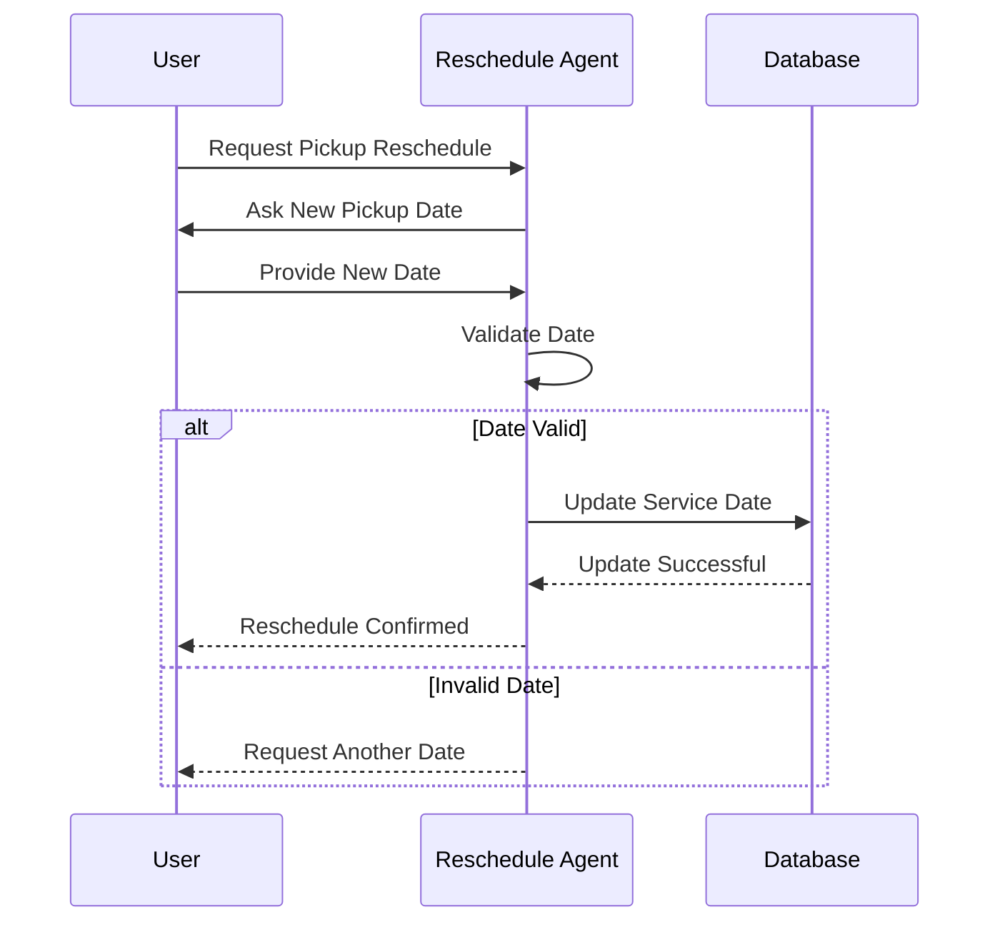

## User Authentication

```mermaid
sequenceDiagram
    participant U as User
    participant R as Root Agent
    participant A as Authentication Agent
    participant DB as Database

    U->>R: Start Conversation
    R->>A: Authenticate User

    alt Existing User
        A->>DB: Verify User Details
        DB-->>A: Authentication Result

        alt Authentication Success
            A-->>U: User Authenticated
        else Authentication Failed
            A-->>U: Authentication Failed
            loop Max 3 Attempts
                U->>A: Retry Authentication
            end
            A->>U: Escalate to Human Agent
        end

    else New User
        A->>U: Request Registration Details
        U->>A: Submit Details
        A->>DB: Save User Information
        DB-->>A: Registration Successful
        A-->>U: Confirm Waste Type & Service Date
    end
```

## Missed Pickup 

```mermaid
sequenceDiagram
    participant U as User
    participant MP as Missed Pickup Agent
    participant DB as Database
    participant SS as Service Status System

    U->>MP: Report Missed Pickup

    MP->>U: Confirm Service Date

    alt Incorrect Date
        U->>MP: Provide Another Date
        MP->>DB: Verify Date
        DB-->>MP: Date Verified
    else Correct Date
        MP->>SS: Check Service Status

        alt Route Delay
            SS-->>MP: Delay Detected
            MP-->>U: Pickup Delayed by 2 Hours

        else Container Blockage
            SS-->>MP: Container Blockage

            alt Blockage Resolved
                MP-->>U: Schedule Next Business Day
            else Not Resolved
                MP-->>U: Schedule Next Week
            end

        else Service Scheduled
            SS-->>MP: Service Completed
            MP-->>U: Pickup Status Completed
        end
    end
```

## Reschedule Pickup

```mermaid
sequenceDiagram
    participant U as User
    participant RA as Reschedule Agent
    participant DB as Database

    U->>RA: Request Pickup Reschedule

    RA->>U: Ask New Pickup Date
    U->>RA: Provide New Date

    RA->>RA: Validate Date

    alt Date Valid
        RA->>DB: Update Service Date
        DB-->>RA: Update Successful
        RA-->>U: Reschedule Confirmed
    else Invalid Date
        RA-->>U: Request Another Date
    end
```
